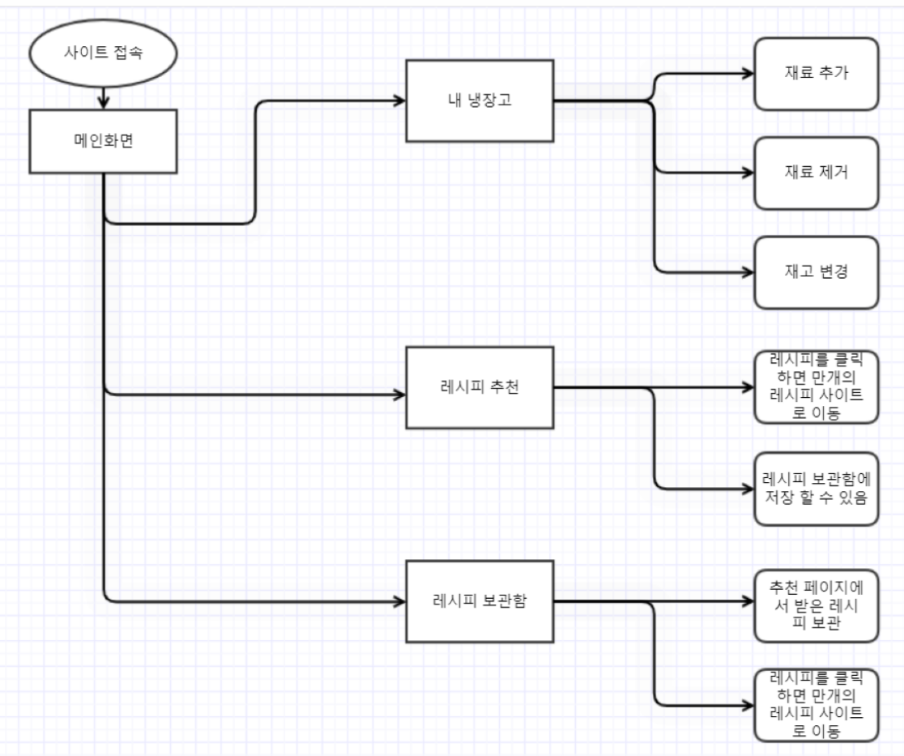
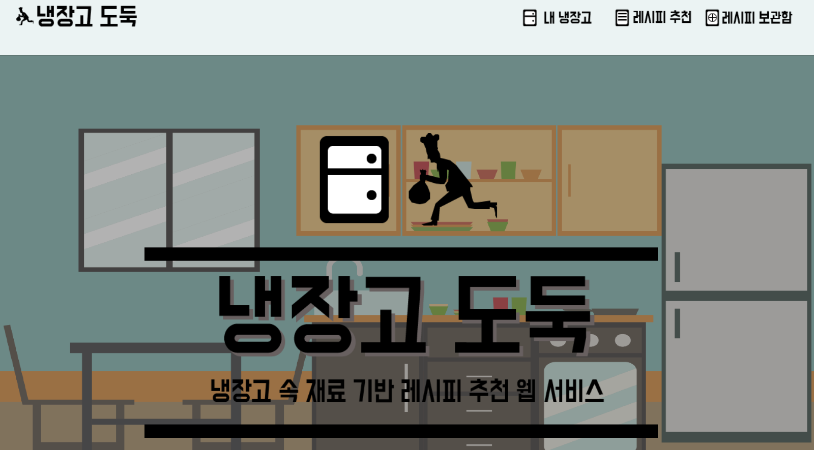
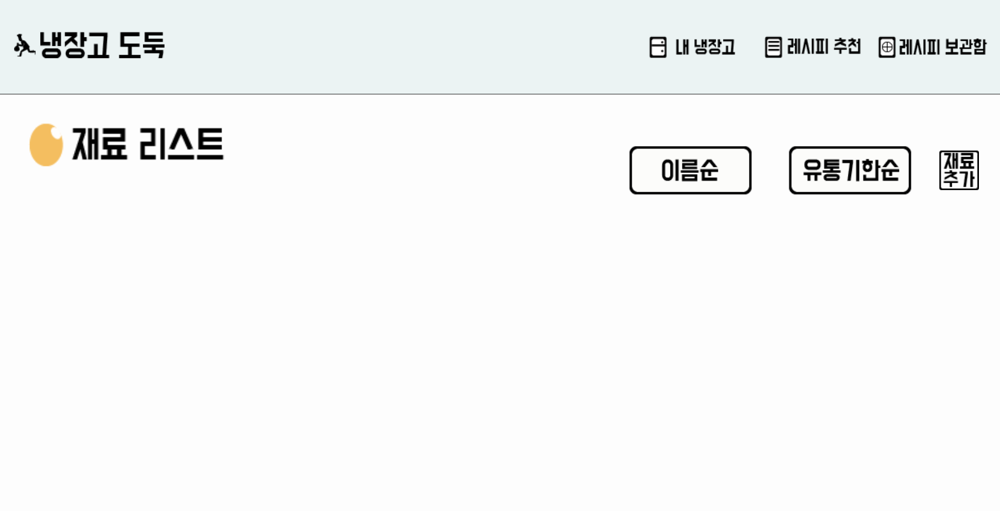
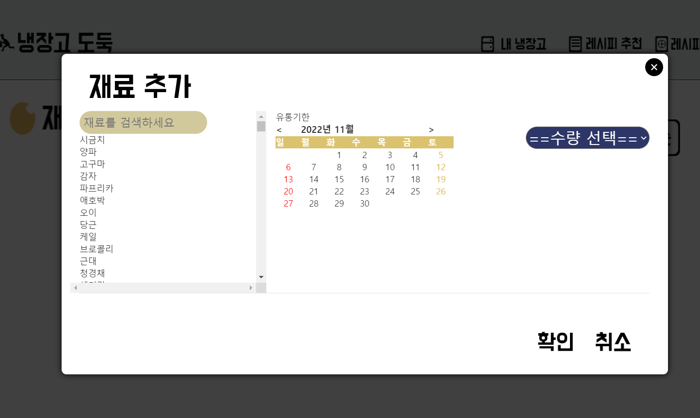
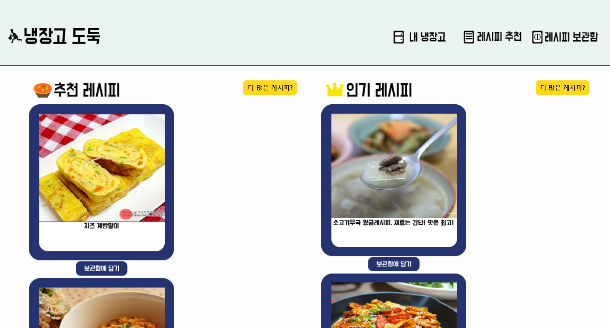
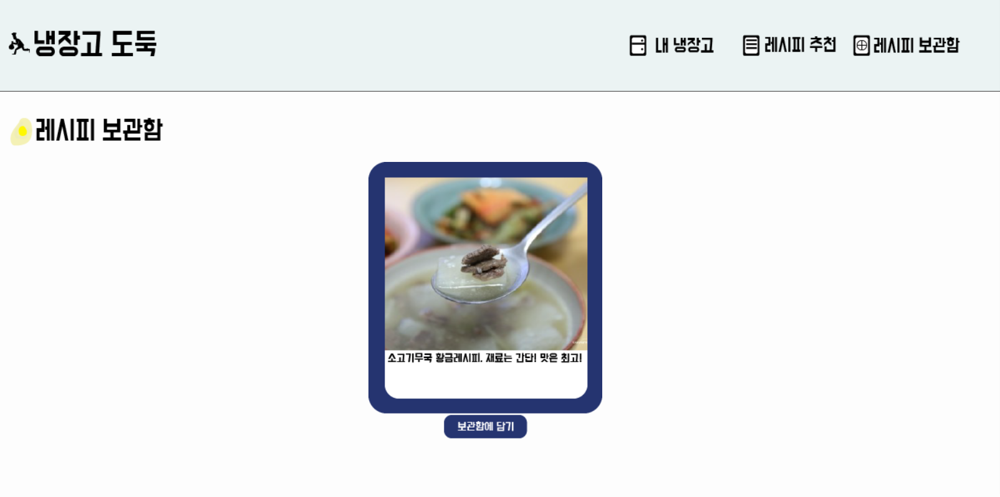

<h1>FriDjango</h1> 

<h2>개요</h2>

 ◾ 최근 코로나, 전쟁 등의 키워드가 수면 위로 떠오름과 동시에, 물가가 폭발적으로 상승하였다. 이에 무소비 • 무지출을 외치는 사람들이 늘어났다. 또한, 환경 오염 문제도 화두가 되면서, 환경에 대한 우려가 커지고 있다.

 ◾ 따라서 대중적이고 보편적인 레시피만 추천받거나 직접 검색을 했어야 했던 사용자들에게 현재 사용자의 상황에 적절한 레시피를 추천해주는 웹 서비스를 제안한다. 사용자의 식재료 현황을 전혀 고려하지 않고 사용자의 수동적인 검색을 요하던 기존의 웹 서비스와는 달리, 사용자 소유 식재료들을 재고 • 유통기한 순으로 순차적으로 처리할 수 있도록 자동적으로 추천해주는 알고리즘을 포함하는 웹 서비스를 제안한다.
 

<h2>기술 스택</h2>

<h3>Frontend</h3>

- Language : HTML, CSS, JS

- Amazon S3

<h3>Backend</h3>

- Language : Python

- Framework : Django-REST-Framework

- Amazon EC2

<h2>FlowChart</h2>

<h2>Pages</h2>

<h3>메인화면</h3>

<h3>재료리스트 화면</h3>

<h3>재료추가 화면</h3>

<h3>레시피추천 화면</h3>

<h3>레시피보관함 화면</h3>

